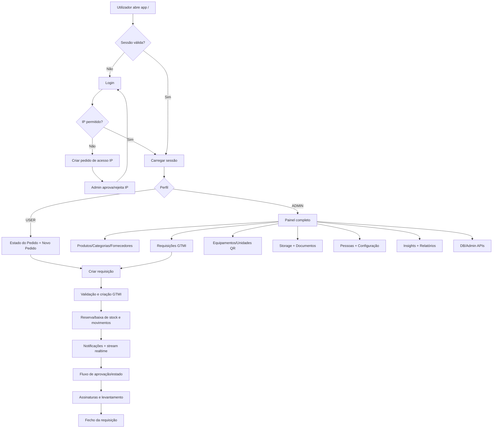
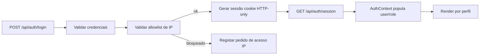
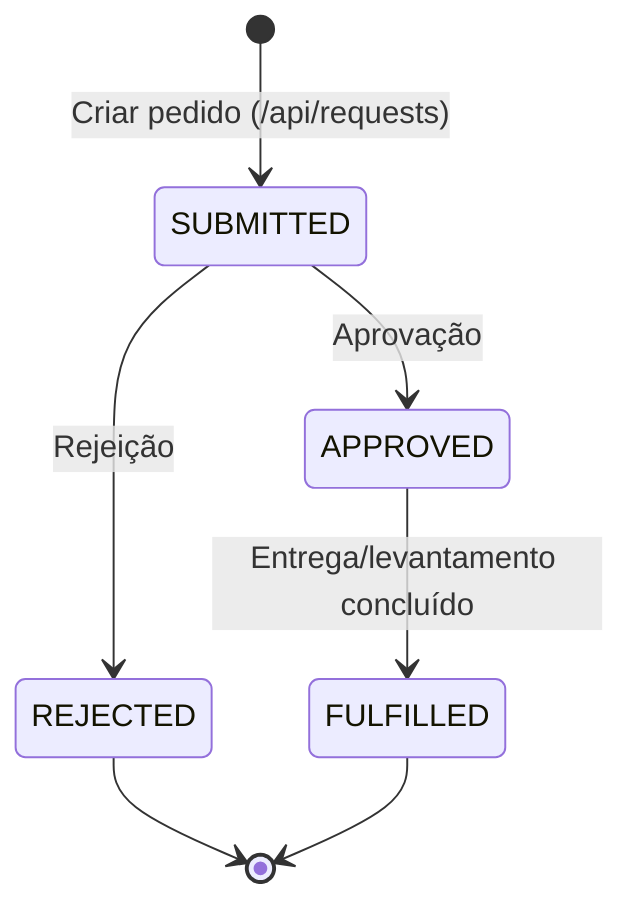
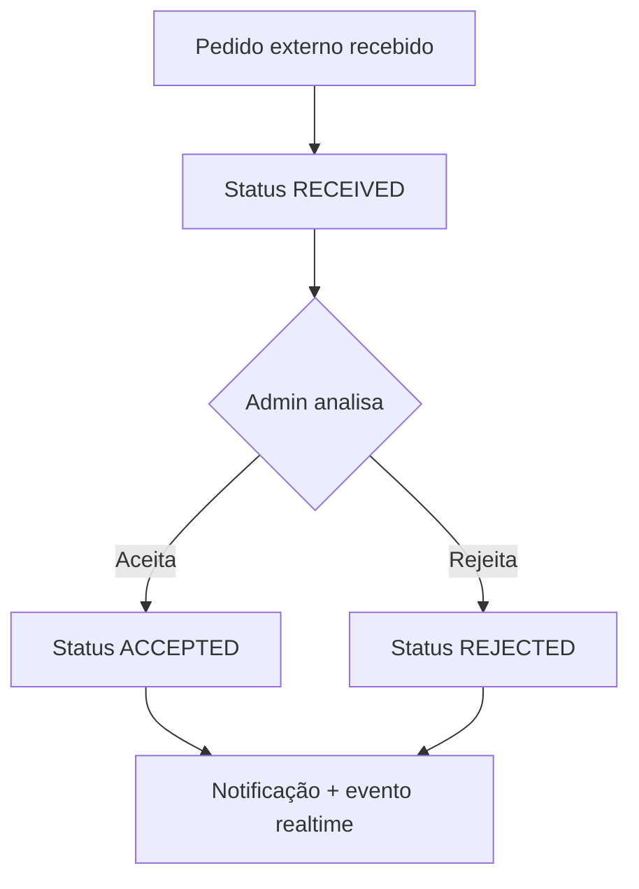

# Diagrama de fluxo da app (estado atual)

Este documento resume o fluxo funcional atual do **Stockly/StockBackup** para facilitar a evolução para cenários mais complexos (ex.: património, financiamento, aprovações multicamada, circuitos interno/externo).

## 1) Fluxo macro da aplicação

## 2) Fluxo de autenticação e acesso

## 3) Fluxo de requisição (GTMI) no estado atual

> Nota: o enum também contém `DRAFT`, mas a criação principal já entra em `SUBMITTED` no endpoint de criação de requisições.

## 4) Fluxo de pedidos públicos/externos

## 5) Módulos já visíveis na navegação

- **Comuns/USER:** Estado do Pedido, Novo Pedido.
- **ADMIN:** Produtos, Requisições, Equipamentos, Storage, DB, Pessoas, Insights, Documentação API, Estado da API.

## 6) Leitura prática para evolução (próximo passo)

Para encaixar novas áreas (património, financiamento, aprovação do presidente, circuito interno/externo), a base atual já permite evoluir por **pipeline de estado**:

1. **Entrada** (pedido interno/externo).
2. **Triagem** (validação documental/serviço requisitante).
3. **Aprovação multicamada** (chefia -> financeiro -> presidência).
4. **Execução** (stock, aquisição, património, contrato).
5. **Fecho e auditoria** (assinaturas, histórico, relatório).

A recomendação é tratar cada nova área como um **subfluxo com estado próprio**, mas ligado ao `Request` principal para manter rastreabilidade ponta-a-ponta.
